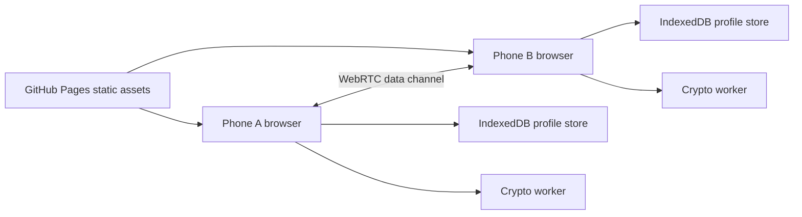

# Match Proof

[Live GitHub Pages site](https://baditaflorin.github.io/match-proof/) · [Repository](https://github.com/baditaflorin/match-proof) · [Support via PayPal](https://www.paypal.com/paypalme/florinbadita)

Privacy-preserving peer matching for shared attributes using browser crypto, WebRTC, Bloom filters, and local inference.

Match Proof is a static GitHub Pages app. It keeps profiles on-device, connects peers directly, and surfaces only verified shared attributes.

## Quickstart

```sh
npm install
make install-hooks
make dev
make test
make smoke
```

## Architecture



The project is Mode A: Pure GitHub Pages. There is no runtime backend, no server-side database, and no frontend secret.

## Documentation

- Architecture: `docs/architecture.md`
- ADRs: `docs/adr/`
- Deploy guide: `docs/deploy.md`
- Privacy: `docs/privacy.md`
- Postmortem: `docs/postmortem.md`
