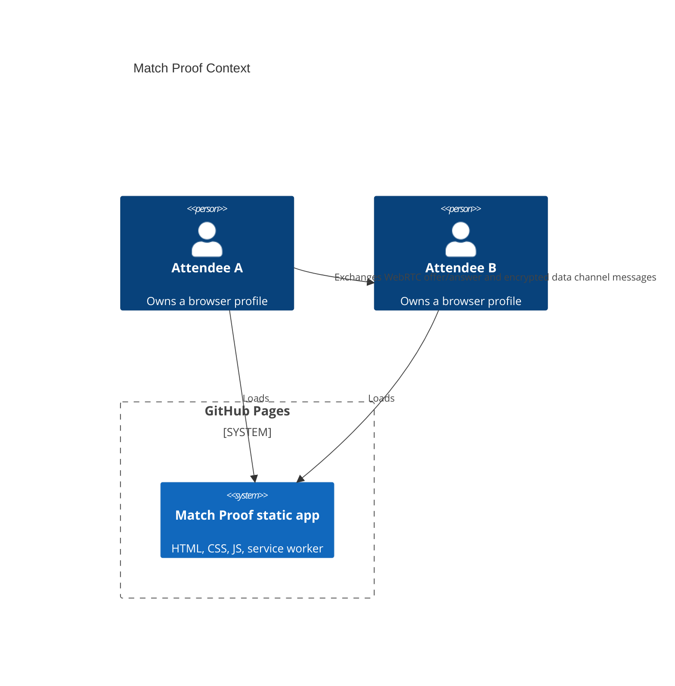
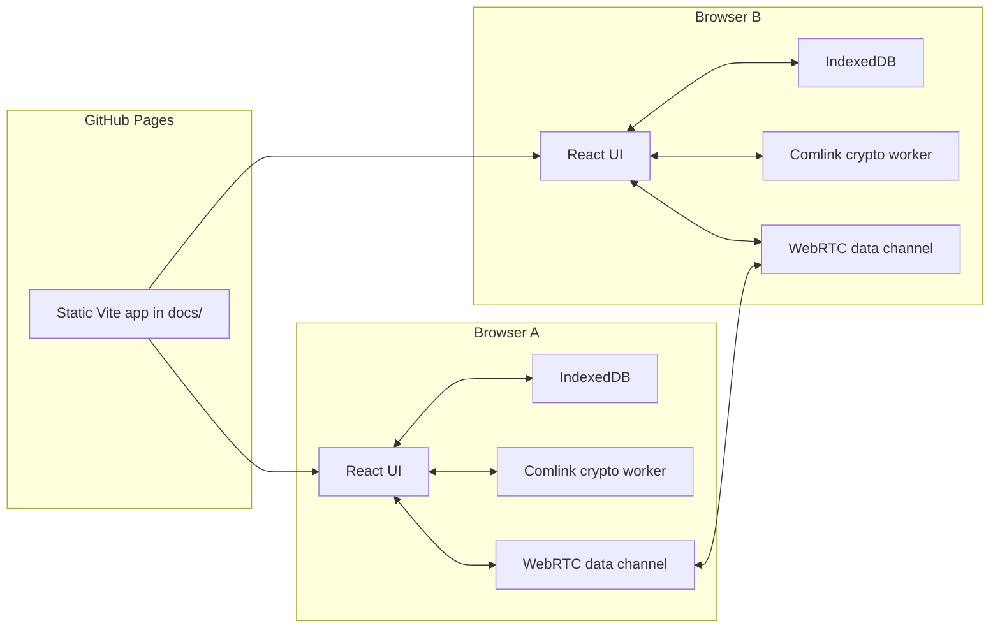

# Architecture

Live site:

https://baditaflorin.github.io/match-proof/

Repository:

https://github.com/baditaflorin/match-proof

## Context

## Container

## Privacy Boundary

GitHub Pages only serves static assets. Attribute data, matching transcripts, and local inference remain in each browser unless the user explicitly exchanges a peer session envelope.
